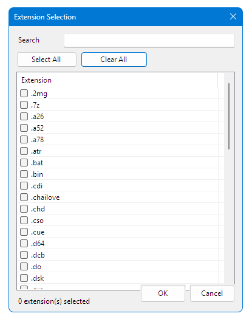

<div align="center">

# 🎮 RetroBat GameList Comparator

> **Is your `gamelist.xml` really synchronized with the ROMs on your drive?**

**RetroBat GameList Comparator** is a free, open-source Windows utility
specialized in **comparing and validating RetroBat `gamelist.xml` files
against the ROMs actually stored on disk.**

Detect missing ROMs, obsolete XML entries, and inconsistencies while
correctly handling RetroBat-specific cases such as **Hidden**, **MultiDisk**
and **ZZZ(NotGame)** entries.

**Latest Release: v2.2.0** 🚀


</div>

---

# 🎯 What is RetroBat GameList Comparator?

RetroBat GameList Comparator focuses on one specific task:

> **Compare what is actually on your disk with what your `gamelist.xml`
> says should be there.**

The application compares a RetroBat ROM folder with its corresponding
`gamelist.xml` and identifies inconsistencies between the files stored on
disk and the entries recorded in the GameList.

It can detect:

- ROMs present on disk but missing from the GameList
- GameList entries whose ROM files are no longer present
- Path inconsistencies
- Entries that should not be counted as independent games
- RetroBat-specific cases that can otherwise create false positives

Unlike a generic file comparison tool, the comparison engine understands
how **RetroBat** and **EmulationStation** organize ROM collections.

The goal is to provide a **clear, reliable and specialized GameList
validation tool** for RetroBat users.

> **RetroBat GameList Comparator is not intended to replace general-purpose
> collection management tools. Its purpose is to provide a precise view of
> the relationship between your ROM files and your `gamelist.xml`.**

---

# ⭐ Highlights

- ✔ Specialized ROM ↔ GameList comparison
- ✔ Accurate comparison engine
- ✔ RetroBat / EmulationStation aware
- ✔ Hidden & MultiDisk aware
- ✔ RetroBat special folder support
- ✔ ScreenScraper `ZZZ(NotGame)` detection
- ✔ One-click `ZZZ(NotGame)` repair
- ✔ Automatic GameList backup
- ✔ Platform statistics
- ✔ TXT / CSV / Diagnostic reports
- ✔ Platform-aware ROM extension detection
- ✔ Automatic `es_systems_*.cfg` detection
- ✔ Automatic fallback to `es_systems.cfg`
- ✔ Drag & Drop support
- ✔ English / French / Spanish
- ✔ Runtime language switching
- ✔ Automatic language persistence
- ✔ Automatic update checker

---

# 🆕 What's New in v2.2.0

Version **2.2.0** introduces intelligent **platform-aware ROM extension
detection** and significant improvements to the Extension Selector.

## 🎮 Automatic Platform Extension Detection

The Extension Selector can now automatically detect the ROM extensions
configured for the selected RetroBat platform.

The application can use platform-specific configuration files:

```text
es_systems_<platform>.cfg
```

For example:

```text
es_systems_aquarius.cfg
es_systems_atarist.cfg
es_systems_saturn.cfg
```

When a platform-specific configuration is not available, the application
automatically falls back to:

```text
es_systems.cfg
```

This allows the Extension Selector to use the extensions actually
configured for the selected RetroBat platform.

### New behavior

- ✅ Automatic detection of platform default extensions
- ✅ Automatic selection of detected default extensions
- ✅ Support for custom `es_systems_*.cfg` files
- ✅ Automatic fallback to `es_systems.cfg`
- ✅ Visual indication of platform default extensions
- ✅ Extension source information
- ✅ Improved behavior when no platform is selected

---

## 🧩 Extension Selector Improvements

The Extension Selector has been redesigned and improved to make extension
selection easier and more transparent.

- ✅ Improved column layout
- ✅ Improved column resizing
- ✅ Automatic platform extension selection
- ✅ Clear visual distinction between default and additional extensions
- ✅ Extension source information
- ✅ Extension search
- ✅ Select All
- ✅ Clear All
- ✅ Extension counter
- ✅ Improved multilingual support

---

## 🌍 v2.2.0 Localization

The new Extension Selector features are available in:

- 🇬🇧 English
- 🇫🇷 Français
- 🇪🇸 Español

See the [CHANGELOG](CHANGELOG.md) for the complete version history.

---

# ✨ Features

## 🔍 Comparison

- ✅ Compare ROM folders with `gamelist.xml`
- ✅ Detect ROMs missing from the XML
- ✅ Detect XML entries missing from disk
- ✅ Accurate platform game statistics
- ✅ Recursive folder scanning
- ✅ Relative path comparison
- ✅ Path normalization
- ✅ Progress feedback
- ✅ Sortable results

---

## 🎮 RetroBat / EmulationStation Support

The comparison engine has been specifically designed around the way
RetroBat and EmulationStation organize GameLists.

### Hidden Games

Entries containing:

```xml
<hidden>true</hidden>
```

are automatically ignored by the comparison engine.

This prevents hidden entries from being incorrectly reported as missing
games.

### MultiDisk Games

MultiDisk child files are automatically ignored when appropriate.

This prevents individual disc files from generating false positives and
ensures that statistics better match the games actually displayed by
RetroBat.

### RetroBat Special Folders

The comparison engine also takes RetroBat special folders into account
when determining which entries should be included in the comparison.

---

# 📁 ROM Extensions

The Extension Selector allows you to control which ROM extensions are
included in the comparison.

## Automatic Detection

Starting with **v2.2.0**, the application can automatically detect the
extensions configured for the selected RetroBat platform.

It searches for:

```text
es_systems_<platform>.cfg
```

and automatically falls back to:

```text
es_systems.cfg
```

when a platform-specific configuration is not available.

## Extension Selector

Features include:

- ✅ Automatic platform extension detection
- ✅ Automatic selection of default extensions
- ✅ Manual extension selection
- ✅ Extension search
- ✅ Select All
- ✅ Clear All
- ✅ Extension counter
- ✅ Visual indication of platform defaults
- ✅ Extension source information

This allows the comparison to focus on the file types actually relevant
to the selected RetroBat platform.

---

# 🆕 ScreenScraper ZZZ(NotGame)

RetroBat GameList Comparator includes dedicated support for ScreenScraper
`ZZZ(NotGame)` entries.

The application can:

- ✅ Detect `ZZZ(NotGame)` entries
- ✅ Display a dedicated counter
- ✅ Display localized information
- ✅ Generate a dedicated report
- ✅ Repair entries automatically

## Automatic Repair

The repair process:

1. Removes the `ZZZ(NotGame):` prefix
2. Restores:

```xml
<hidden>false</hidden>
```

3. Creates an automatic GameList backup
4. Refreshes the comparison automatically

The automatic backup provides an additional safety layer before modifying
the GameList.

---

# 📊 Statistics

The application provides detailed statistics about the comparison.

Statistics include:

- ⭐ Platform Games
- ROMs Compared
- XML Entries
- Missing from XML
- Missing from Disk
- MultiDisk Ignored
- Hidden Games
- `ZZZ(NotGame)` entries

The objective is to provide statistics that closely match the games
actually displayed by RetroBat.

---

# 📄 Reports

RetroBat GameList Comparator can generate several report types.

## TXT

Generate a readable text report containing the comparison results.

## CSV

Export comparison results for further analysis in spreadsheet software.

## GameList Diagnostic Report

Generate a diagnostic report containing information useful for analyzing
GameList inconsistencies.

## ZZZ(NotGame) Report

A dedicated report is available for ScreenScraper `ZZZ(NotGame)` entries.

It can include:

- Detected entries
- ROM filename
- Relative path
- Platform statistics
- Generation date

---

# 🖱️ User Interface

The application is designed to remain simple while providing detailed
information when needed.

Available features include:

- ✅ Drag & Drop
- ✅ Automatic `gamelist.xml` detection
- ✅ Smart Compare button
- ✅ Progress bar
- ✅ Sortable result lists
- ✅ Double-click to open a ROM folder
- ✅ Runtime language switching
- ✅ Automatic language persistence

---

# 🎯 Drag & Drop

You can simply drag files or folders onto the application.

## 📁 ROM Folder

Drag a ROM folder onto the application.

The application automatically:

- Detects the ROM folder
- Fills the ROM folder field
- Searches for the corresponding `gamelist.xml`

## 📄 GameList

Drag a `gamelist.xml` file onto the application.

The application automatically fills the required GameList information.

This makes it possible to start a comparison in only a few seconds.

---

# 🌍 Localization

RetroBat GameList Comparator includes a multilingual system with runtime
language switching.

Currently supported languages:

- 🇬🇧 English
- 🇫🇷 Français
- 🇪🇸 Español

## Localization Features

- Runtime language switching
- No restart required
- Automatic language persistence
- Automatic refresh of opened windows
- Localized Extension Selector
- Localized ZZZ(NotGame) information

The localization architecture is designed to support additional languages
in future releases.

---

# 📸 Screenshots

## Main Window

<p align="center">

</p>

---

## About

<p align="center">

</p>

---

## Extension Selector

<p align="center">

</p>

---

# 🚀 Installation

## Recommended — Self-contained x64

Download the latest **Self-contained x64** release.

The self-contained version requires:

- ❌ No installation
- ❌ No separate .NET Runtime

Simply extract the ZIP archive and launch:

```text
RetroBatGameListComparator.exe
```

### Latest Release

[Download the latest release](https://github.com/theJim69/RetroBatGameListComparator/releases/latest)

---

## Portable Version

A smaller portable package is also available.

The portable version requires:

```text
.NET 8 Desktop Runtime
```

---

# 🖱️ Usage

## 1. Select your ROM folder

Select the RetroBat ROM folder you want to analyze.

## 2. Select the GameList

Select the corresponding:

```text
gamelist.xml
```

You can also use Drag & Drop.

## 3. Select the platform

Choose the corresponding RetroBat platform when applicable.

Starting with **v2.2.0**, the application can automatically detect the
platform's configured ROM extensions.

## 4. Select the extensions

Review the detected extensions and adjust them if necessary.

Platform default extensions are automatically selected when detected.

## 5. Click Compare

The application scans the ROM folder and compares the results with the
GameList.

The results identify:

- ROMs missing from XML
- XML entries missing from disk
- Hidden games
- MultiDisk entries
- `ZZZ(NotGame)` entries
- Platform statistics

---

# 📋 Example Workflow

```text
ROM Folder
    │
    ▼
Select Platform
    │
    ▼
Detect RetroBat configuration
    │
    ├── es_systems_<platform>.cfg
    │
    └── fallback → es_systems.cfg
    │
    ▼
Detect platform extensions
    │
    ▼
Select / adjust extensions
    │
    ▼
Compare ROM folder
    │
    ▼
Compare gamelist.xml
    │
    ▼
Display results
    │
    ├── Missing from XML
    ├── Missing from Disk
    ├── Hidden
    ├── MultiDisk
    └── ZZZ(NotGame)
    │
    ▼
Generate reports
```

---

# 🧠 Comparison Engine

The comparison engine is one of the core components of RetroBat
GameList Comparator.

It is designed specifically to understand RetroBat GameLists rather than
performing a simple filename-to-filename comparison.

The engine automatically handles cases such as:

- Hidden games
- MultiDisk child files
- RetroBat special folders
- Relative paths
- Platform-specific ROM extensions
- ScreenScraper `ZZZ(NotGame)` entries

This reduces false positives and provides more meaningful comparison
results.

---

# ⚡ Performance

The application is designed to remain lightweight and responsive while
working with large RetroBat collections.

The project focuses on:

- Efficient XML loading
- Optimized comparison
- Recursive scanning
- Responsive progress reporting
- Maintainable architecture

Performance and reliability are prioritized over unnecessary complexity.

---

# 🛠 Built With

- C#
- .NET 8
- Windows Forms
- XML
- GitHub REST API

---

# 📋 Roadmap

The roadmap focuses on improving **GameList validation, diagnostics and
maintenance** while keeping the comparison engine at the center of the
application.

Current priorities include:

- Documentation quality
- Release validation
- Stability
- Performance
- Localization
- User experience
- Advanced GameList diagnostics
- Duplicate detection
- XML consistency validation
- Collection health reports
- Repair suggestions

Quality and reliability always take priority over adding new features.

For more information, see the dedicated
[ROADMAP](ROADMAP.md).

---

# 💡 Future Ideas

The following features are ideas for future development and are **not
currently available unless explicitly listed in the Features section**.

## 🔍 Advanced Analysis

Possible future features:

- Duplicate detection
- XML consistency validation
- Collection health reports
- Advanced diagnostics
- Repair suggestions

## 🛠 GameList Maintenance

Possible future features:

- XML cleanup
- Duplicate removal
- Automatic backups
- Metadata consistency checking
- Artwork verification

## ⚙️ Batch Operations

Possible future features:

- Batch rename
- Batch metadata update
- Batch artwork verification
- Extension conversion support

## 📊 Additional Reports

Possible future formats:

- HTML
- PDF
- JSON

## 🚀 Performance

Possible future improvements:

- Multi-threaded scanning
- Faster XML loading
- Improved comparison engine
- Better memory usage

## 🌍 Additional Languages

Possible future translations:

- German
- Italian
- Portuguese
- Community translations

---

# 🤝 Community

Feature requests, bug reports and pull requests are always welcome.

If you have an idea that could improve the project, please open an
**Issue** on GitHub.

Community feedback plays an important role in shaping the future of
RetroBat GameList Comparator.

---

# 🎯 Current Focus

The current objective is to make **RetroBat GameList Comparator** a
reliable and specialized reference tool for validating RetroBat
GameLists.

Current priorities are:

- Reliability
- Performance
- Ease of use
- Accurate comparison
- Clear reporting
- Maintainable architecture
- Localization
- User experience

**Quality and stability always have priority over adding new features.**

---

# 📜 Version History

## v2.2.0 — August 13, 2026

### 🎮 Platform Extension Detection

- Automatic detection of platform-specific extension configurations
- Support for custom `es_systems_*.cfg`
- Fallback to `es_systems.cfg`
- Automatic platform default extension detection
- Automatic selection of default extensions
- Visual indication of default platform extensions
- Extension source information

### 🧩 Extension Selector Improvements

- Improved Extension Selector layout
- Improved column layout and resizing
- Improved extension selection behavior
- Improved behavior when no platform is selected
- Improved multilingual support
- Localized platform extension information
- Localized default extension indicators

---

## v2.1.0

Introduced the first complete workflow for managing ScreenScraper
`ZZZ(NotGame)` entries.

- `ZZZ(NotGame)` detection
- Dedicated counter
- Localized tooltip
- Dedicated TXT report
- One-click automatic repair
- Automatic GameList backup
- Automatic comparison refresh
- Improved comparison accuracy
- Better handling of RetroBat special folders

---

# 📄 License

This project is licensed under the **MIT License**.

See the [LICENSE](LICENSE) file for details.

---

# 👤 Author

Created and maintained by **theJim**

GitHub:

https://github.com/theJim69

Project:

https://github.com/theJim69/RetroBatGameListComparator

---

# ❤️ Special Thanks

- RetroBat Team
- RetroBat Community
- EmulationStation
- ScreenScraper
- All users who report bugs
- All users who suggest improvements
- Everyone contributing to the RetroBat ecosystem

---

<div align="center">

### ⭐ If you like this project, consider giving it a star on GitHub!

It helps the project gain visibility and motivates future development.

**Thank you for your support! ❤️**

</div>
