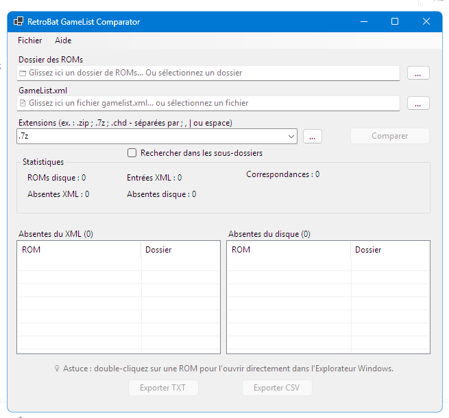
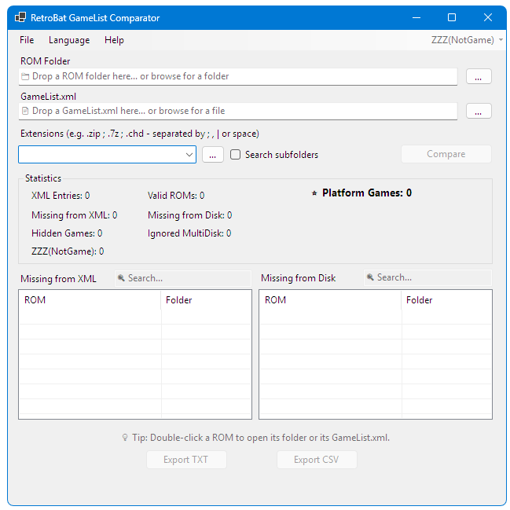

<div align="center">

# 🎮 RetroBat GameList Comparator

**Compare your RetroBat ROM folders with `gamelist.xml` in seconds.**

A lightweight Windows utility to detect missing ROMs, obsolete XML entries and keep your RetroBat collections perfectly synchronized.

<br>


</div>

---

# 📸 Screenshots

## Main Window

<p align="center">

</p>

The application's main interface.

---

## About Dialog

<p align="center">

</p>

---

# ✨ Features

- ✅ Compare ROM folders with `gamelist.xml`
- ✅ Detect ROMs missing from the XML
- ✅ Detect XML entries missing from disk
- ✅ Support multiple ROM extensions
- ✅ Recursive folder scanning
- ✅ Automatic detection of new ROM extensions
- ✅ Drag & Drop support
- ✅ Automatic `gamelist.xml` detection
- ✅ Smart **Compare** button
- ✅ Progress bar during analysis
- ✅ Sortable result lists
- ✅ Double-click to open a ROM location
- ✅ TXT export
- ✅ CSV export
- ✅ Modern Windows interface

---

# 🚀 Installation

## Recommended

Download the latest **win-x64 Self-contained** release.

No installation and no .NET runtime required.

Simply extract the ZIP archive and run:

```text
RetroBatGameListComparator.exe
```

---

## Portable Version

A smaller portable package is also available.

**Requires the .NET 8 Desktop Runtime to be installed.**

---

# 🖱️ Usage

1. Select your RetroBat ROM folder.
2. Select the corresponding `gamelist.xml`.
3. Choose the ROM extensions.
4. Click **Compare**.

The application automatically detects:

- Missing ROMs in the XML
- Missing ROMs on disk

Results can be exported to:

- TXT
- CSV

---

# 🎯 Drag & Drop

Simply drag:

- 📁 A ROM folder → the application automatically fills the ROM folder and detects `gamelist.xml`
- 📄 A `gamelist.xml` file → both fields are automatically completed

---

# 🛠️ Built With

- C#
- .NET 8
- Windows Forms

---

# 📋 Roadmap

## Version 1.1

- Status bar
- Context menu
- Remember last opened folders
- Improved progress reporting
- Better UI polish

## Version 2.0

- Automatic GameList synchronization
- XML editor
- Automatic metadata updates

---

# 🤝 Contributing

Suggestions, bug reports and pull requests are welcome.

If you have an idea for a new feature, feel free to open an Issue.

---

# 📄 License

This project is licensed under the MIT License.

See the [LICENSE](LICENSE) file for details.

---

# 👤 Author

theJim

GitHub:

https://github.com/theJim69/RetroBatGameListComparator
